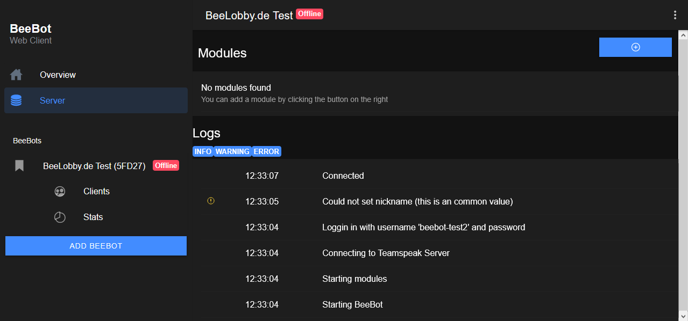
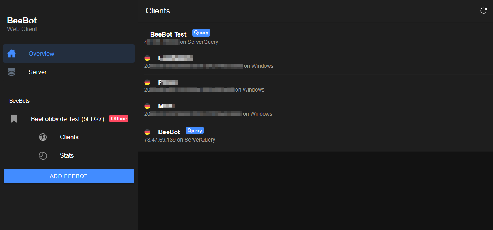
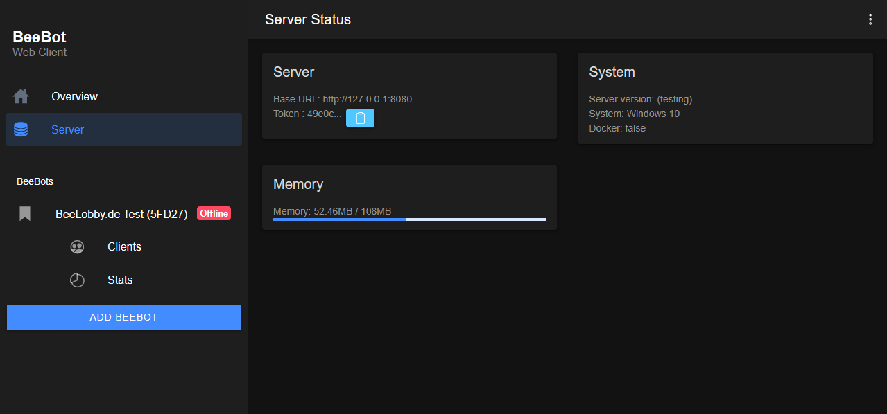
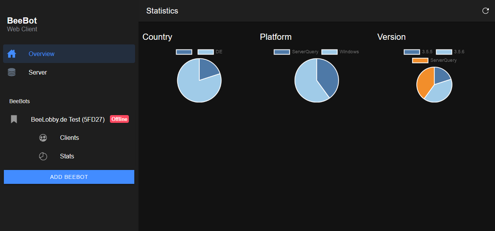

# BeeBot Client
This is the angular/ionic client for BeeBot server (https://github.com/marcschuler/BeeBot-Server)

## Official Instance
The official instance is available at https://beebot.karlthebee.de

## Run
``npm install
  ionic serve``
  
## Build
``ionic build --prod`'
